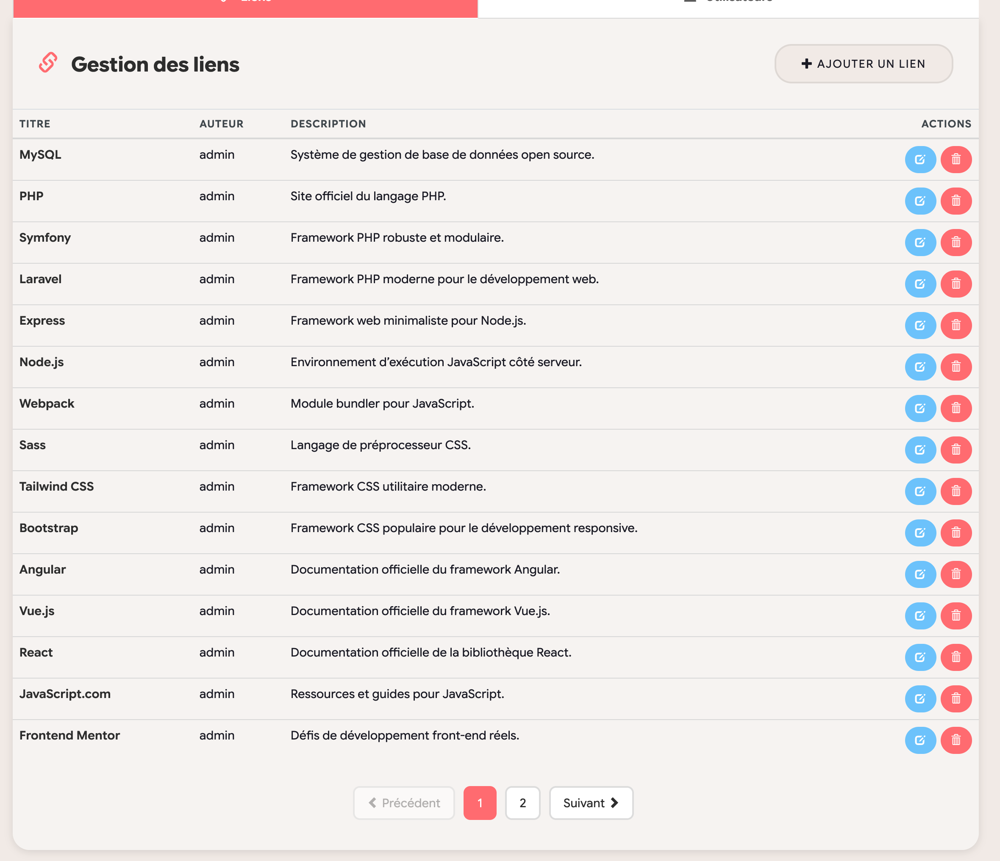
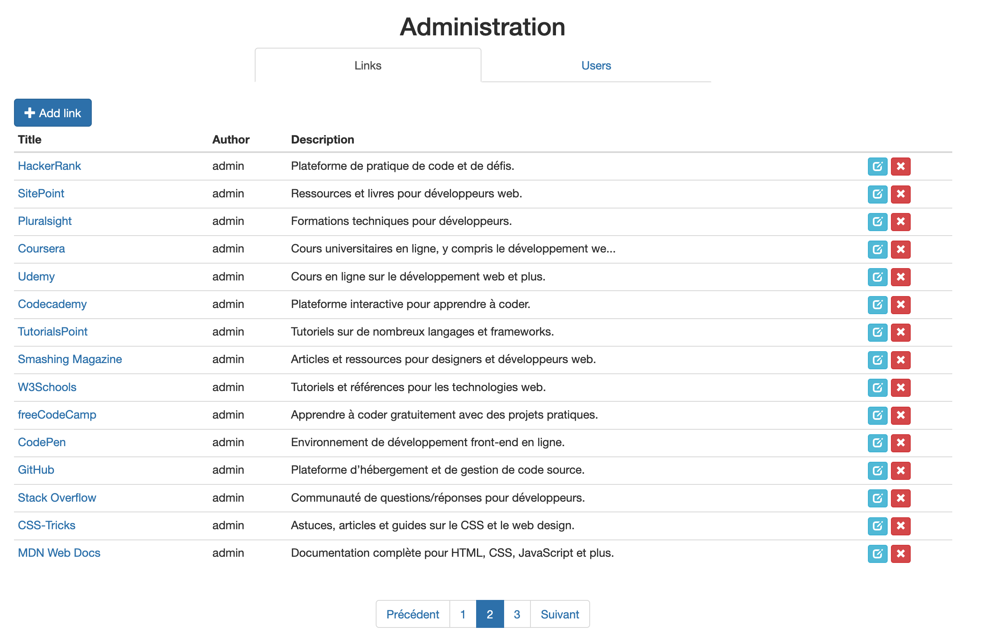

# UEL313 : Bibliothèques logicielles - GROUPE 6 - S3

## Membres du groupe

| Etudiant.e  |   Alias    |
| :---------: | :--------: |
| Mathilde C. | Clouddy23  |
|   Kamo G.   | Spaghette5 |
| Mathieu L.  |  mathleys  |
| Filippos K. |  filkat34  |

## Objectifs

- [x] Assurer la maintenance corrective et évolutive d'une application existante
- [x] Savoir utiliser le client git et la plateforme Github en vue de collaborer au sein d'une équipe de développement.

## Environnement de développement

- Cloner ce dépôt GIT sur votre machine.
- Suivre le guide d'installation de l'environnement docker (pdf fourni dans les ressources de l'UE) en remplaçant lors de l'étape "Run a new container" le "Host path" par le chemin vers le dossier cloné du dépôt sur votre machine.

## Principe général de collaboration

### Répartition du travail

|  Flux RSS  | Page Links   |  Refonte UI       |
| :------:   | :------------:  | :------:          |
| Filippos   |    Mathilde & Mathieu   |   Kamo & Mathieu |

### Calendrier

Une réunion d'équipe est prévue à chaque fin d'échéance.

| Echéance   |                                                                          Objectif                                                         |
| :---:      |:-------------------------------------------------------------------------------------------------------------------------------           |
| 11/12      | Phase de documentation et de réflexion sur la façon d'implémenter la fonctionnalité. Décrire le choix d'implémentation retenu ci-dessous. |
| 13/12      | Phase de développement de chaque fonctionnalité sur une branche distincte.                                                                |
| 14/12      | Relecture des branches, fusion et tests manuels fonctionnels.                                                                             |

## Phase de documentation et de réflexion

Ci-dessous sont explicitées les implémentations choisies pour chaque intervention évolutive sur l'application.

### Flux RSS
Les cadriciels fournissent souvent des modules spécifiques pour la génération de flux RSS comme [sfeed](https://symfony.com/legacy/doc/cookbook/1_1/fr/syndication) pour Symfony. Vu la simplicité du fonctionnement de cette application, nous avons décidé de ne pas avoir recours à l'un de ces modules mais de mettre en place nous-mêmes le flux RSS en suivant le protocole d'implémentation suivant :
* Création d'une nouvelle route pour le flux RSS `/feed`  qui servira le flux RSS.
* Ajout d'une méthode DAO pour récupérer les 15 derniers liens dans `LinkDAO.php`
* Création d'un nouveau contrôleur `RssFeedController.php` qui récupère les 15 derniers liens grâce à la méthode DAO précédemment implémentée et qui génère le fichier xml du flux à partir des liens récupérés.

### Page de liens
Pour la pagination du back-office, on a choisit une approche côté serveur (PHP/SQL) plutôt qu’en JavaScript avec architecture MVC (DAO pour les données, contrôleur pour la logique métier, vue pour le rendu HTML avec Twig).

**Objectif :** Limiter la quantité de données chargées (éviter le chargement de toute la table tl_liens) et respecter la contrainte de 15 liens/page directement au niveau de la BDD.
* Côté DAO (LinkDAO) : Ajout de la méthode countAll() pour renvoyer le nombre total de liens présents + Ajout de la méthode findByPage() qui calcule un offset (décalage) selon le numéro de page, exécute une requête avec tri descendant et qui transforme les lignes SQL en objets via la méthode qui existe déjà buildDomainObject().
* Côté contrôleur (AdminController::indexAction) : Ajout de l’objet Request pour pouvoir lire le paramètre ?page= dans l’URL + Récupération du numéro de page + Appel de countAll() pour compter le nombre total de liens et donc du nombre total de pages + Vérification que page demandée ne dépasse pas la dernière page (sinon on donne la dernière page) + Remplacement de findAll() par findByPage($page, $limit) pour récupérer que les 15 liens de la page courante + Passage à la view Twig des variables links, page et totalPages.
* Côté vue (admin.html.twig) : Réutilisation du tableau pour afficher les liens avec ajout de la class pagination de Bootstrap pour afficher proprement les liens vers les pages 1 jusqu'à la dernière, pour indiquer la page courante comme active, pour désactiver les boutons "précédent" et "suivant" si on est sur la page 1 ou la dernière page et pour génèrer les URLs avec pour rester cohérent avec route /admin.

### Refonte UI

## Phase de développement

Plusieurs issues ont été identifiées en fonction des fonctionnalités à implémenter :

1. Chaque membre de l'équipe s'assigne une issue en fonction de son choix dans la répartition du travail.
2. Il crée une branche sur laquelle il travaille sur l'issue choisie en lui donnant un nom correspondant à ce qu'il implémente. Exemples : `feature/fluxRSS`, `feature/pagelinks`, etc.
3. Une fois son travail fini, il fait une demande de tirage et dans la description, ne pas oublier de lier la demande à une issue en mettant "Fixes #[numéro de l'issue concernée]" (par exemple : "Fixes #11"). Github se chargera de fermer l'issue en question une fois la fusion de la demande faite.

## Tests manuels fonctionnels
Pour la page de liens, nous avons ajouté un système de pagination dans l’espace d’administration, limitant l’affichage à 15 liens par page. Cela permet de fluidifier la navigation et d’éviter l’affichage d’une liste trop longue.

